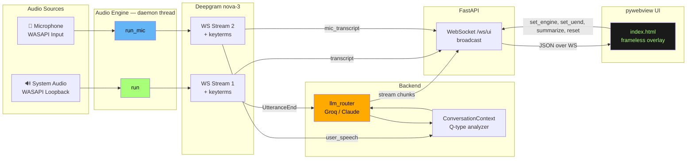

<div align="center">

# 🎙️ Interview Copilot

### *Your invisible AI companion for live interviews — real-time transcription, instant answers, total stealth.*

[](https://www.python.org/)
[](https://www.microsoft.com/windows)
[](https://deepgram.com/)
[](https://groq.com/)
[](https://www.anthropic.com/)
[](https://github.com/pavan19a97/Interview-Helper/releases/tag/v1.4.0)
[](https://opensource.org/licenses/MIT)

[**Features**](#-features) • [**Architecture**](#-architecture) • [**Quick Start**](#-quick-start) • [**Configuration**](#-configuration) • [**Tech Stack**](#-tech-stack)

---

</div>

## ✨ Overview

**Interview Copilot** is a Windows desktop overlay that listens to a live interview through your speakers, transcribes the interviewer in real time with Deepgram **nova-3**, and streams human-like answers from **Groq** or **Anthropic Claude** — all in a frameless, always-on-top window that's **invisible to screen capture** (Zoom / Teams / Meet won't see it).

> 💡 Built for the candidate who wants AI co-pilot superpowers without breaking eye contact.

<div align="center">

```
   ┌─────────────────────────────────────────┐
   │  ⚡ Copilot   ⚡Groq  ■□  ◐━━●  ⏱━●━  ●  │
   ├─────────────────────────────────────────┤
   │  CURRENT                                │
   │  Interviewer  Tell me about a time       │
   │               you scaled an ML pipeline │
   │  AI           You know, at Wells Fargo  │
   │               we processed 500M records │
   │               daily on Databricks…      │
   │  You          Yeah, exactly — and the   │
   │               trick was MLflow tracking │
   ├─────────────────────────────────────────┤
   │     [SUMMARIZE]  [CLEAR]                │
   ├─────────────────────────────────────────┤
   │  HISTORY                                │
   │  ──────────────                         │
   │  Q  What's your stack?      ↳Follow-up │
   │  A  Mostly Python, FastAPI…            │
   └─────────────────────────────────────────┘
```

*The overlay sits on top of your meeting window — frameless, draggable, screen-capture invisible.*

</div>

---

## 🎯 Features

<table>
<tr>
<td width="50%" valign="top">

### 🔊 **Dual Audio Capture**
- **Loopback** captures the interviewer's voice via WASAPI
- **Microphone** captures your own responses
- Both stream concurrently, transcribed independently

### ⚡ **Real-Time Transcription**
- Deepgram **nova-3** with smart formatting
- 23 domain keyterms (LangChain, Databricks, Pinecone…)
- Adjustable pause sensitivity (500–3000ms slider)
- KeepAlive frames prevent silence-based disconnects

### 🧠 **Context-Aware Answers**
- Detects **NEW_TOPIC**, **FOLLOW_UP**, **REPHRASED**, **CLARIFICATION**
- Carries last 3 Q&A pairs as context to the LLM
- Records what *you actually said* alongside AI suggestions

</td>
<td width="50%" valign="top">

### 🥷 **Stealth UI**
- Frameless, always-on-top, draggable
- **Screen-capture excluded** via `SetWindowDisplayAffinity`
- Adjustable opacity (10–100%) — see-through when needed
- Dark / Light themes

### 📋 **Session Tools**
- **SUMMARIZE** — end-of-interview debrief (themes, gaps, prep tips)
- **SAVE** — persists full session to `data/sessions/*.json` and clears context
- **CLEAR** — wipes history and resets LLM conversation context
- **📎 DOCS** — upload .txt / .md / .json / .pdf / .docx files as live context
- Persistent settings via `localStorage` (theme, engine, opacity, pause)

### 🔄 **Engine Switching**
- ⚡ **Groq** — `llama-3.1-8b-instant` (fastest)
- 🧠 **Claude** — `claude-haiku-4-5` (highest quality)
- Switch mid-session, no restart

</td>
</tr>
<tr>
<td width="50%" valign="top">

### 🎯 **Sentence Karaoke Highlight**
- Answer text split into sentences after streaming completes
- Active sentence highlighted with green outline + background
- Matched word inside bolded + underlined for pinpoint accuracy
- Fuzzy matching with Levenshtein distance (tolerates ASR errors)
- Stem + filler removal (`um`, `uh`, `like`…) before matching
- Contraction expansion (`don't` → `do not`) for better recall
- Distance penalty prevents multi-sentence jumps on weak evidence
- Look-ahead auto-advance: pre-jumps to next sentence when within last ~5 words
- Active sentence always scrolls to **center** of the answer view

</td>
<td width="50%" valign="top">

### 🔒 **Reliability & Stealth**
- Thread-safe `Settings` class (`RLock`) — no race conditions under load
- Fire-and-forget LLM tasks keep Deepgram receive loop unblocked
- Dual Deepgram health banner — tracks loopback + mic independently
- Audio queue drop counter logs upstream lag visibility
- Mute clears in-flight transcript buffer (no stale partials after unmute)
- `You` row clamped to ~2 lines, auto-scrolls to show latest speech
- Question-type tagging in history (`↳ Follow-up`, `↻ Rephrased`, `? Clarify`)

</td>
</tr>
</table>

---

## 🏗️ Architecture



### Threading Model

| Thread | Purpose | Event Loop |
|--------|---------|-----------|
| **Main (STA COM)** | pywebview window | n/a — blocks on `webview.start()` |
| **Daemon — uvicorn** | FastAPI WebSocket | ProactorEventLoop |
| **Daemon — audio** | Loopback + Mic capture | SelectorEventLoop *(Python 3.13 fix)* |

> Cross-thread `broadcast()` uses `asyncio.run_coroutine_threadsafe` against the captured uvicorn loop — no shared state hazards.

---

## 🚀 Quick Start

### Prerequisites
- **Windows 10 / 11** (WASAPI loopback is Windows-only)
- **Python 3.13+**
- API keys for Deepgram, Groq, and Anthropic

### Installation

```bash
git clone https://github.com/pavan19a97/Interview-Helper.git
cd Interview-Helper
pip install -r requirements.txt
```

### Configuration

Create a `.env` file in the project root:

```env
DEEPGRAM_API_KEY=your_deepgram_key_here
GROQ_API_KEY=your_groq_key_here
ANTHROPIC_API_KEY=your_anthropic_key_here
```

Get your keys here:
- 🟢 [Deepgram Console](https://console.deepgram.com/) — free tier includes nova-3
- 🟠 [Groq Cloud](https://console.groq.com/) — free, very fast inference
- 🟣 [Anthropic Console](https://console.anthropic.com/) — pay-as-you-go

### Run

```bash
python main.py
```

The overlay appears in the top-right of your screen, frameless and on top.

---

## 🎛️ UI Controls

<div align="center">

| Control | Function |
|---------|----------|
| **⚡ Engine** | Switch between Groq (fast) and Claude (quality) |
| **■ □** | Dark / Light theme toggle |
| **◐ Slider** | Background opacity 10–100% |
| **⏱ Slider** | Pause sensitivity 500–3000ms (when LLM fires) |
| **● Status Dot** | 🟢 connected · 🟡 reconnecting · 🔴 offline |
| **─** | Minimize |
| **✕** | Close |
| **SUMMARIZE** | Generate end-of-session debrief |
| **SAVE** | Save session to `data/sessions/*.json` and clear context |
| **CLEAR** | Reset history + LLM conversation context |
| **📎 DOCS** | Upload context documents (PDF, DOCX, TXT, MD, JSON) |
| **Drag (header)** | Move window |
| **Resize grip** | Bottom-right corner |

</div>

---

## 🛠️ Tech Stack

<div align="center">

| Layer | Technology |
|-------|-----------|
| **UI** | `pywebview` + HTML/CSS/JS — Edge WebView2 on Windows |
| **Server** | `FastAPI` + `uvicorn` over WebSocket |
| **Audio** | `pyaudiowpatch` for WASAPI loopback + mic |
| **STT** | `Deepgram nova-3` streaming WebSocket API |
| **LLM** | `groq` SDK (LLaMA 3.1) · `anthropic` SDK (Claude Haiku 4.5) |
| **Stealth** | Win32 `SetWindowDisplayAffinity` + `LWA_ALPHA` |

</div>

---

## 📂 Project Structure

```
Interview-Helper/
├── 🐍 main.py                  # Entry point — pywebview + FastAPI + threads
├── 📁 core/
│   ├── audio_engine.py        # WASAPI loopback + mic + Deepgram streaming
│   ├── llm_router.py          # Groq + Claude streaming, summarize_session
│   └── context_manager.py     # Q-type analyzer, conversation history
├── 📁 web/
│   └── index.html             # Frameless overlay UI (HTML/CSS/JS)
├── 📄 requirements.txt
├── 📄 .env                    # API keys (not committed)
├── 📋 CHANGELOG.md
└── 📖 README.md
```

---

## 🧪 How It Works

### 1️⃣ Audio capture
Two `pyaudio` streams run in parallel:
- **Loopback** grabs anything playing through your speakers (the interviewer on a call)
- **Microphone** grabs your own voice for the "You said" track

### 2️⃣ Transcription
Each stream pipes raw PCM into a Deepgram WebSocket. Interim results paint the UI in real time; an `UtteranceEnd` event marks the end of a thought.

### 3️⃣ Context analysis
When the interviewer's utterance ends, `ConversationContext._analyze_question_type()` decides: is this a *new topic*, a *follow-up*, a *rephrase*, or a *clarification*? The label colors the question in the UI and informs the prompt.

### 4️⃣ LLM streaming
The transcript + last 3 Q&A pairs of context get fed to the chosen engine. Tokens stream back over the WebSocket and paint the AI row character-by-character.

### 5️⃣ Sentence karaoke highlight
Once the answer finishes streaming, it's split into sentence spans. As you speak your reply, the mic transcript is normalized (stems, filler removal, contraction expansion) and fuzzy-matched against each sentence using sliding-window Jaccard similarity with Levenshtein word tolerance. The matching sentence gets a green outline + background; the matched word gets bold + underline. A distance penalty prevents jumps of 2+ sentences unless confidence is high. When you're within ~5 words of finishing a sentence, the highlight pre-advances to the next one.

### 6️⃣ Session debrief
Hit **SUMMARIZE** at the end — the entire session (questions, AI suggestions, what you actually said) goes to the LLM and you get a 4-section debrief: themes, strong moments, gaps, and prep tips for next time.

---

## 🎨 Customization

Edit `core/llm_router.py` to swap the candidate profile in `SYSTEM_PROMPT` for your own background. The current profile targets a **Principal AI Engineer** with FinTech experience.

Add your domain terms to `_DG_KEYWORDS` in `core/audio_engine.py` for better proper-noun recognition (frameworks, tools, company names).

---

## 🔒 Privacy & Stealth

- **Screen capture exclusion** — `SetWindowDisplayAffinity(hwnd, WDA_EXCLUDEFROMCAPTURE)` makes the window invisible to OBS, Zoom share, Teams share, screenshot tools
- **No telemetry** — all data flows directly: your machine ⇄ Deepgram ⇄ Groq/Anthropic
- **No persistence** — transcripts and Q&A pairs live only in memory; CLEAR wipes them

> ⚠️ Use responsibly. Many companies prohibit AI assistance during interviews — check the rules of the company you're interviewing with.

---

## 🐛 Troubleshooting

<details>
<summary><b>The Interviewer row stays empty</b></summary>

- Check the status dot — if 🔴, the WebSocket isn't connected
- Look for a red **Deepgram offline** banner — likely an API key issue
- Verify audio is actually playing through your default speakers (loopback only catches what you can hear)

</details>

<details>
<summary><b>The AI never answers</b></summary>

- The terminal will show `[llm_router] ERROR — ...` on API failures — check your Groq / Anthropic key
- The default trigger is any non-empty utterance, but very short interim transcripts (1–2 words) won't trigger until UtteranceEnd fires after `utterance_end_ms` of silence

</details>

<details>
<summary><b>Mic stream not capturing</b></summary>

- The terminal prints `[mic_engine] No mic found, skipping` if no default WASAPI input is set
- Set a default microphone in **Settings → System → Sound → Input**

</details>

<details>
<summary><b>Window won't drag / resize</b></summary>

- Drag from the dark header (avoid the controls)
- Resize from the dotted grip in the bottom-right corner

</details>

---

## 🗺️ Roadmap

- [ ] Session export to Markdown
- [ ] Hotkey to toggle visibility
- [ ] Custom prompt templates per role (PM / Eng / DS)
- [ ] Multi-language support
- [ ] Audio device selector in UI
- [ ] Cross-platform (macOS via CoreAudio)

---

## 📄 License

MIT — do whatever you want, but a star ⭐ is appreciated.

---

<div align="center">

**Built with ❤️ for the candidate who refuses to be caught off-guard.**

[Report Bug](https://github.com/pavan19a97/Interview-Helper/issues) · [Request Feature](https://github.com/pavan19a97/Interview-Helper/issues)

</div>
